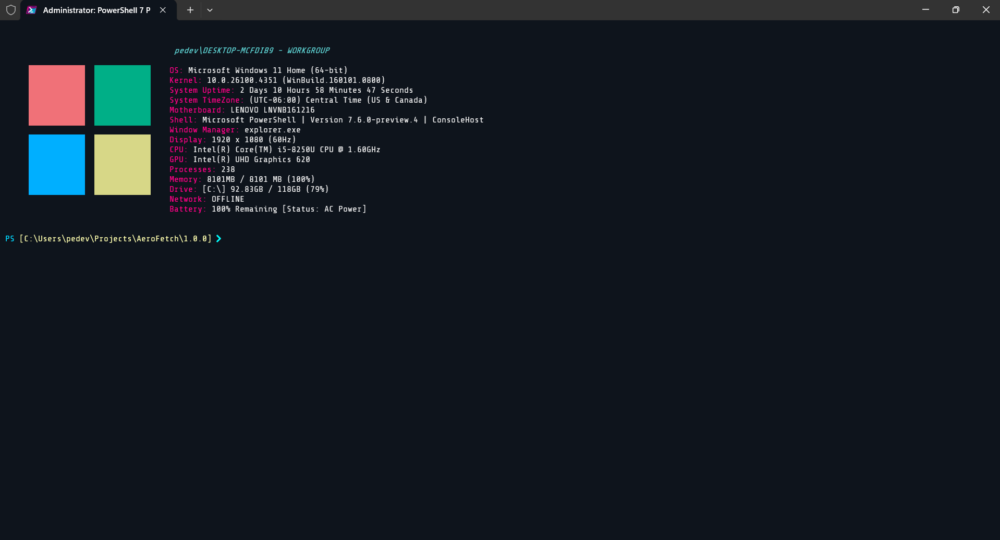
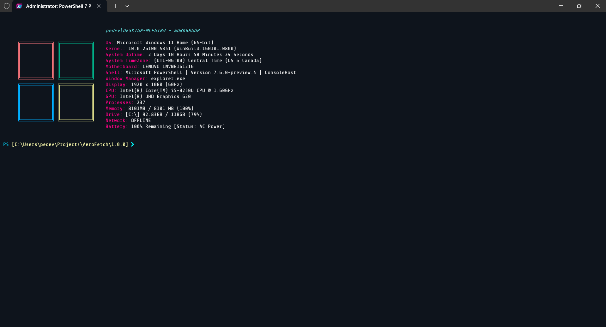
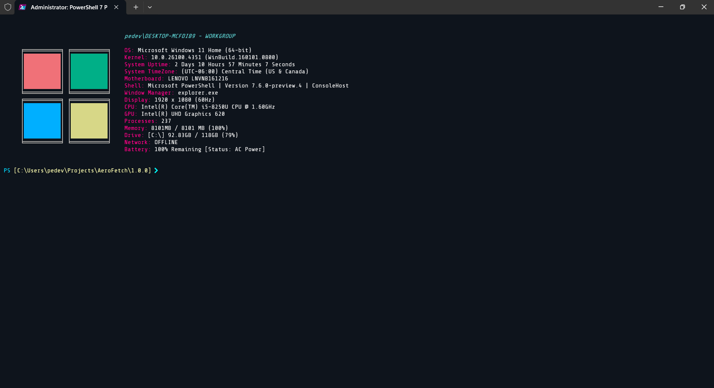
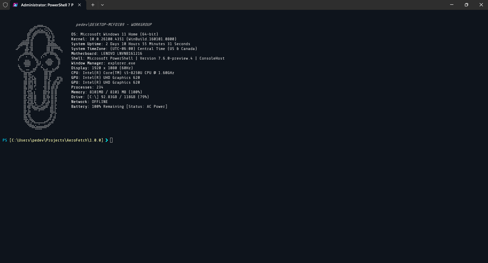

# AeroFetch

***AeroFetch:*** *The System Information Screenshot Utility for Microsoft Windows*

## Overview

**AeroFetch** *is a PowerShell-based implementation of the popular Linux Command-Line Utility, [Screenfetch by KittyKatt](https://www.github.com/KittyKatt/screenfetch), that has been tailored for use in Microsoft Windows Operating Systems.*

## Installation

*To install AeroFetch via the PowerShell Gallery:*

`Install-Module -Name 'AeroFetch' -AllowPrerelease | Import-Module`

## Usage

*The following is a breakdown of the commands included with the Module:*

### AeroFetch

*Displays relevant System Information alongside an Ascii Art Image in a visually appealing manner*

### Get-AeroFetchSettings

*Returns the current User Defined Settings*

### Set-AeroFetchSetting

*Sets the value of a specified User Defined Setting*

### Get-AeroFetchAssets

*Returns a list of all Ascii Art Assets available*

### Get-AeroFetchColorThemes

*Returns a list of all Color Themes available*

## Planned Features

*The following features are planned to be added in future updates:*

* **Create and format custom Ascii Art Images, import them and use them in AeroFetch**
* **Create custom Color Themes to use in AeroFetch**
* **Customize Entries of Information displayed (remove unwanted entries, or create and add custom ones!)**
* **Cacheing of non-changing System Details to improve performance**

## Screenshots

**ASCII Art:** *Eleven*

 **ColorTheme:** *WinClassic*

**ASCII Art:** *Eleven_Frame*

 **ColorTheme:** *WinClassic*

**ASCII Art:** *Eleven_Frame_Alt_Fill*

 **ColorTheme:** *WinClassic*

**ASCII Art:** *Clippy*

 **ColorTheme:** *Greyscale*

